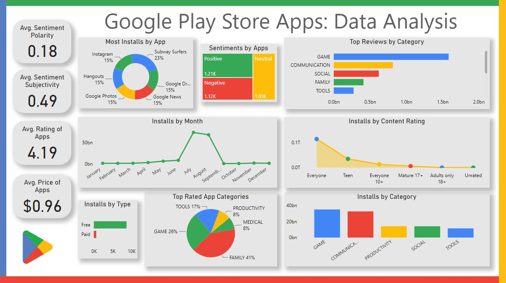

<h1> Google Play Store Apps: Data Analysis </h1>
Created interactive dashboard from scratch using Power BI. This dashboard effectively showcases significant revelations through a variety of visualization methods.
For example: most frequently downloaded applications, review trends, app categories, rating distribution, and the pattern of app installations across different months, etc.
And predicted some insights like which categories might get the best ratings or which apps could become really popular. 
By putting all this information together on the dashboard, it helps app makers and other people decide which types of apps or specific apps are the best ones to focus on to get more people interested.

